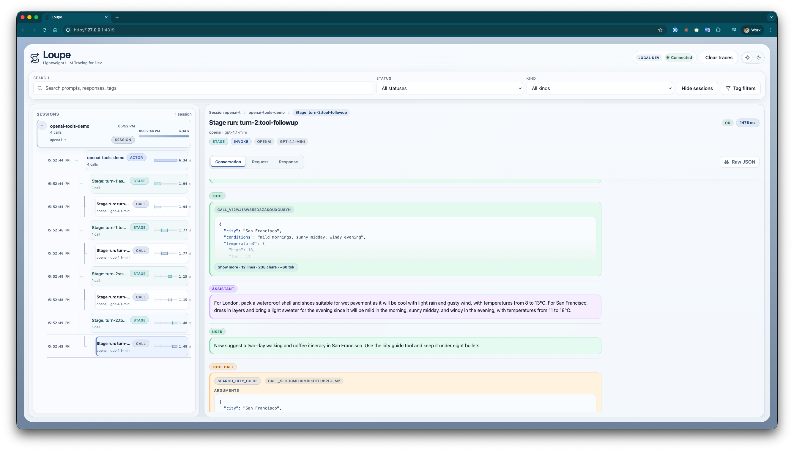
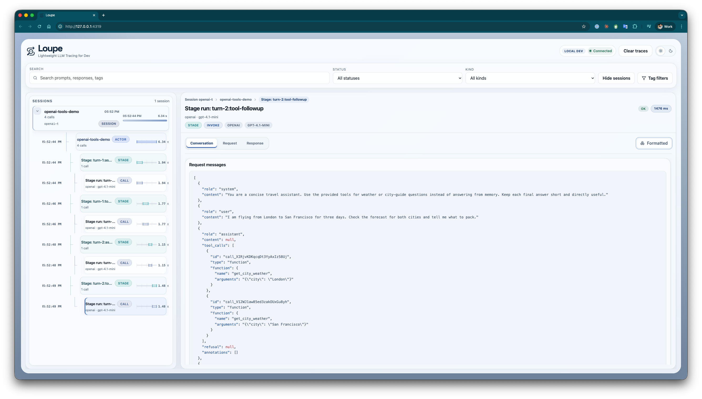

<p align="center">
  
</p>

# @mtharrison/loupe


Loupe is a lightweight local tracing dashboard for LLM applications and agent systems. It captures full request and response payloads with tags and hierarchy context, then serves an inspector UI on `127.0.0.1` with no database, no containers, and no persistence.

This package is for local development. Traces live in memory and are cleared on restart.

## Why Loupe

Most tracing tools assume hosted infrastructure, persistent storage, or production telemetry. Loupe is deliberately smaller:

- local-only dashboard
- in-memory ring buffer
- full request and response visibility
- streaming chunk capture and reconstruction
- hierarchy for sessions, actors, child actors, stages, and guardrails
- cost rollups when token usage and pricing are available
- zero external services

## Screenshots

Conversation view with tool calls, staged traces, and session navigation:



Request view showing the captured OpenAI payload for a multi-turn tool call:



## Installation

```sh
npm install @mtharrison/loupe
```

### Requirements

- Node.js 18 or newer

## Quick Start

Enable tracing explicitly:

```bash
export LLM_TRACE_ENABLED=1
```

Or just run your app with `NODE_ENV=development`. Loupe now enables tracing implicitly in development and opens the dashboard automatically on first start in an interactive local terminal.

If your app already uses a higher-level model interface or the official OpenAI client, Loupe can wrap that directly instead of requiring manual `record*` calls.

### `wrapOpenAIClient(client, getContext, config?)`

Wraps `client.chat.completions.create(...)` on an OpenAI-compatible client and records either an `invoke` trace or a `stream` trace based on `params.stream`.

```ts
import {
  wrapOpenAIClient,
} from '@mtharrison/loupe';
import OpenAI from 'openai';

const client = wrapOpenAIClient(
  new OpenAI(),
  () => ({
    sessionId: 'session-123',
    rootActorId: 'support-assistant',
    actorId: 'support-assistant',
  }),
);

const completion = await client.chat.completions.create({
  model: 'gpt-4.1',
  messages: [{ role: 'user', content: 'Summarize the latest notes.' }],
});

const stream = await client.chat.completions.create({
  model: 'gpt-4.1',
  messages: [{ role: 'user', content: 'Stream the same summary.' }],
  stream: true,
});

for await (const chunk of stream) {
  process.stdout.write(chunk.choices?.[0]?.delta?.content || '');
}
```

If you do not call `startServer()` yourself, the dashboard starts lazily on the first recorded trace.

When the server starts, Loupe prints the local URL:

```text
[llm-trace] dashboard: http://127.0.0.1:4319
```

In `NODE_ENV=development`, Loupe also opens that URL in your browser automatically unless `CI` is set, the terminal is non-interactive, or `LOUPE_OPEN_BROWSER=0`.

If `4319` is already in use and you did not explicitly configure a port, Loupe falls back to another free local port and prints that URL instead.

`wrapOpenAIClient()` is structurally typed, so Loupe's runtime API does not require the OpenAI SDK for normal library usage. The repo includes `openai` as a dev dependency for the bundled demo; if your own app instantiates `new OpenAI()` or runs the published example from a consumer install, install `openai` there too.

### `wrapChatModel(model, getContext, config?)`

Wraps any object with `invoke()` and `stream()` methods.

### Runnable OpenAI Tools Demo

There is also a runnable example at `examples/openai-multiturn-tools.js` that:

- starts the Loupe dashboard eagerly
- wraps an OpenAI client with `wrapOpenAIClient()`
- runs a multi-turn conversation with tool calls
- keeps the process alive so the in-memory traces stay visible in the dashboard

From this repo, after installing this package's dev dependencies, run:

```bash
npm install
export OPENAI_API_KEY=your-key
export LLM_TRACE_ENABLED=1
node examples/openai-multiturn-tools.js
```

If you copy this example pattern into another app, install `openai` in that app before using `new OpenAI()`.

Supported demo environment variables: `OPENAI_MODEL`, `LLM_TRACE_PORT`, `LOUPE_OPEN_BROWSER`.

The script tries to open the dashboard automatically and prints the local URL either way. Set `LOUPE_OPEN_BROWSER=0` if you want to suppress the browser launch.

### Runnable Nested Tool-Call Demo

`examples/nested-tool-call.js` is a credential-free demo that:

- starts the Loupe dashboard eagerly
- wraps a root assistant model and a nested tool model
- invokes the nested tool model from inside the parent model call
- shows parent/child spans linked on the same trace

Run it with:

```bash
npm install
export LLM_TRACE_ENABLED=1
node examples/nested-tool-call.js
```

### Runnable Fully Featured Demo

`examples/fully-featured.js` is a credential-free demo that combines the main local tracing features in one session:

- a top-level input guardrail span recorded with the low-level lifecycle API
- a wrapped `invoke()` call with a nested stage span and child actor span
- a handled child-span error so the dashboard shows both success and failure states
- a wrapped `stream()` call with reconstructed output and usage

Run it with:

```bash
npm install
export LLM_TRACE_ENABLED=1
node examples/fully-featured.js
```

Supported demo environment variables: `LLM_TRACE_PORT`, `LOUPE_OPEN_BROWSER`.

## Low-Level Lifecycle API

If you need full control over trace boundaries, Loupe exposes a lower-level span lifecycle API modeled on OpenTelemetry concepts: start a span, add events, end it, and record exceptions.

Loupe stores GenAI span attributes using the OpenTelemetry semantic convention names where they apply, including `gen_ai.request.model`, `gen_ai.response.model`, `gen_ai.system`, `gen_ai.provider.name`, `gen_ai.operation.name`, `gen_ai.usage.input_tokens`, `gen_ai.usage.output_tokens`, and `gen_ai.conversation.id`.

Start the dashboard during app startup, then instrument a model call:

```ts
import {
  getLocalLLMTracer,
  isTraceEnabled,
  endSpan,
  recordException,
  startSpan,
  type TraceContext,
} from '@mtharrison/loupe';

if (isTraceEnabled()) {
  await getLocalLLMTracer().startServer();
}

const context: TraceContext = {
  sessionId: 'session-123',
  rootSessionId: 'session-123',
  rootActorId: 'support-assistant',
  actorId: 'support-assistant',
  provider: 'openai',
  model: 'gpt-4.1',
  tags: {
    environment: 'local',
    feature: 'customer-support',
  },
};

const request = {
  input: {
    messages: [{ role: 'user', content: 'Summarize the latest notes.' }],
    tools: [],
  },
  options: {},
};

const spanId = startSpan(context, {
  mode: 'invoke',
  name: 'openai.chat.completions',
  request,
});

try {
  const response = await model.invoke(request.input, request.options);
  endSpan(spanId, response);
  return response;
} catch (error) {
  recordException(spanId, error);
  throw error;
}
```

### Streaming

Streaming works the same way. Loupe records each span event, first-chunk latency, and the reconstructed final response.

```ts
import {
  addSpanEvent,
  endSpan,
  recordException,
  startSpan,
} from '@mtharrison/loupe';

const spanId = startSpan(context, {
  mode: 'stream',
  name: 'openai.chat.completions',
  request,
});

try {
  for await (const chunk of model.stream(request.input, request.options)) {
    if (chunk?.type === 'finish') {
      endSpan(spanId, chunk);
    } else {
      addSpanEvent(spanId, {
        name: `stream.${chunk?.type || 'event'}`,
        attributes: chunk,
        payload: chunk,
      });
    }

    yield chunk;
  }
} catch (error) {
  recordException(spanId, error);
  throw error;
}
```

## Trace Context

Loupe gets its hierarchy and filters from the context you pass to `startSpan()`.

### Generic context fields

- `sessionId`
- `rootSessionId`
- `parentSessionId`
- `rootActorId`
- `actorId`
- `actorType`
- `provider`
- `model`
- `tenantId`
- `userId`
- `stage`
- `guardrailType`
- `guardrailPhase`
- `tags`

Loupe derives higher-level kinds automatically:

- `actor`
- `child-actor`
- `stage`
- `guardrail`

If you pass `guardrailType` values that start with `input` or `output`, Loupe also derives `guardrailPhase`.

### Compatibility aliases

Loupe still accepts the older project-specific field names below so existing integrations do not need to change immediately:

| Generic field | Legacy alias |
| --- | --- |
| `sessionId` | `chatId` |
| `rootSessionId` | `rootChatId` |
| `parentSessionId` | `parentChatId` |
| `rootActorId` | `topLevelAgentId` |
| `actorId` | `agentId` |
| `actorType` | `contextType` |
| `stage` | `workflowState` |
| `guardrailType` | `systemType` |
| `guardrailPhase` | `watchdogPhase` |

Loupe normalizes those aliases into the generic model before storing traces.

## What Gets Captured

Each trace stores:

- request input and options
- sanitized request headers
- final response payload
- stream chunk events and reconstructed stream output
- usage payload
- error payloads
- tags and hierarchy context
- timings and durations

Sensitive headers such as `authorization`, `api-key`, `x-api-key`, and `openai-api-key` are redacted before storage.

## Cost Tracking

Loupe calculates per-call and rolled-up cost when your model returns usage in this shape:

```ts
{
  usage: {
    tokens: {
      prompt: 123,
      completion: 456,
    },
    pricing: {
      prompt: 0.000001,
      completion: 0.000002,
    },
  },
}
```

If usage or pricing is missing, Loupe still records the trace, but cost will show as unavailable.

## Dashboard

The local dashboard includes:

- session-first tree navigation
- hierarchy-aware browsing
- conversation, request, response, context, and stream views
- formatted and raw JSON modes
- cost and latency badges
- live updates over SSE
- light and dark themes

This UI is intended for local inspection, not production monitoring.

## Configuration

Environment variables:

| Variable | Default | Description |
| --- | --- | --- |
| `LLM_TRACE_ENABLED` | `true` when `NODE_ENV=development`, otherwise `false` | Enables Loupe. |
| `LLM_TRACE_HOST` | `127.0.0.1` | Host for the local dashboard server. |
| `LLM_TRACE_PORT` | `4319` | Port for the local dashboard server. If unset, Loupe tries `4319` first and falls back to a free local port if it is already in use. |
| `LLM_TRACE_MAX_TRACES` | `1000` | Maximum number of traces kept in memory. |
| `LLM_TRACE_UI_HOT_RELOAD` | auto in local interactive dev | Enables UI rebuild + reload while developing the dashboard itself. |
| `LOUPE_OPEN_BROWSER` | `enabled` in local `NODE_ENV=development` sessions | Opens the dashboard in your browser on first server start. Set `0` to suppress it. |

Programmatic configuration is also available through `getLocalLLMTracer(config)`.

## API

Loupe exposes both low-level span lifecycle functions and lightweight wrappers.

### `isTraceEnabled()`

Returns whether tracing is enabled from environment configuration.

### `getLocalLLMTracer(config?)`

Returns the singleton tracer instance. This is useful if you want to:

- start the dashboard during app startup
- override host, port, or trace retention
- access the in-memory store in tests

### `startTraceServer(config?)`

Starts the local dashboard server eagerly instead of waiting for the first trace.

### `startSpan(context, options?, config?)`

Creates a span and returns its Loupe `spanId`. Pass `mode`, `name`, and `request` in `options` to describe the operation. Nested spans are linked automatically when wrapped calls invoke other wrapped calls in the same async flow.

### `addSpanEvent(spanId, event, config?)`

Appends an event to an existing span. For streaming traces, pass the raw chunk as `event.payload` to preserve chunk reconstruction in the UI.

### `endSpan(spanId, response, config?)`

Marks a span as complete and stores the final response payload.

### `recordException(spanId, error, config?)`

Marks a span as failed and stores a serialized exception payload.

All of these functions forward to the singleton tracer returned by `getLocalLLMTracer()`.

### `wrapChatModel(model, getContext, config?)`

Returns a traced model wrapper for `invoke()` and `stream()`.

### `wrapOpenAIClient(client, getContext, config?)`

Returns a traced OpenAI client wrapper for `chat.completions.create(...)`.

## HTTP Endpoints

Loupe serves a small local API alongside the UI:

- `GET /`
- `GET /api/traces`
- `GET /api/traces/:id`
- `GET /api/hierarchy`
- `GET /api/events`
- `DELETE /api/traces`

## Development

The package lives in the `llm-trace/` workspace folder, even though the public package name is `@mtharrison/loupe`.

```bash
cd llm-trace
npm install
npm run build
npm test
```

Relevant directories:

- `src/` runtime, store, server, and HTML bootstrapping
- `client/src/` React dashboard
- `scripts/` UI build helpers
- `test/` package tests

## Non-Goals

Loupe is intentionally not:

- a production observability platform
- a multi-process collector
- a persistent trace database
- a hosted SaaS product

If you need long-term retention, team sharing, or production-grade telemetry, Loupe is the wrong tool.

## License

MIT.
